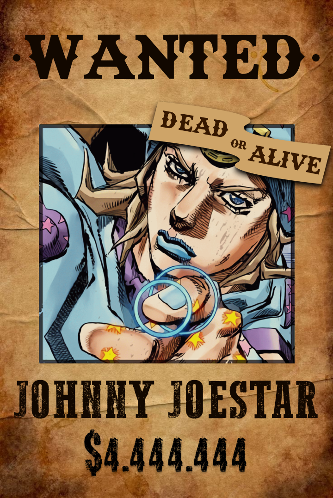
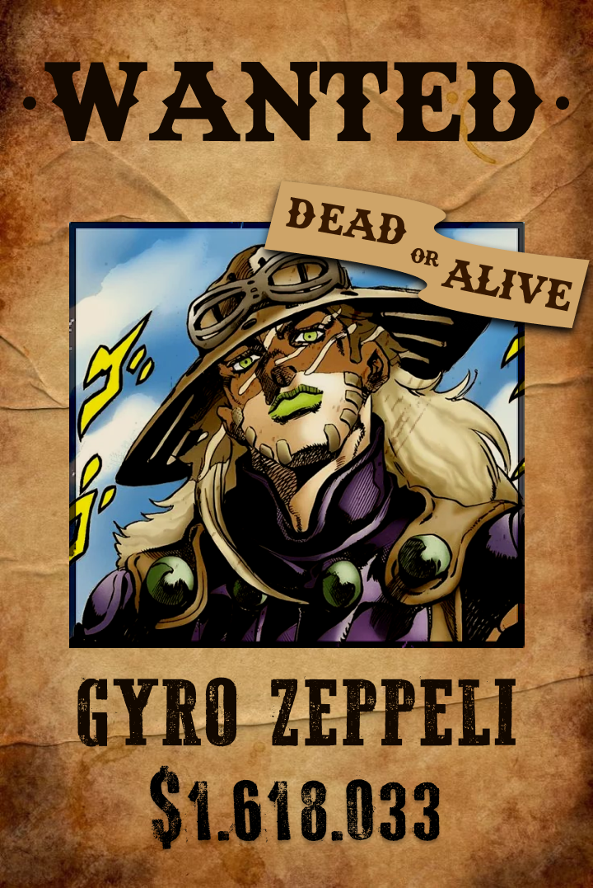
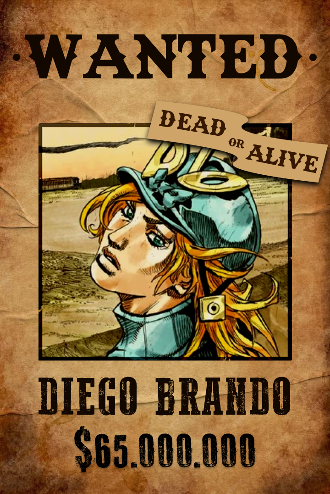
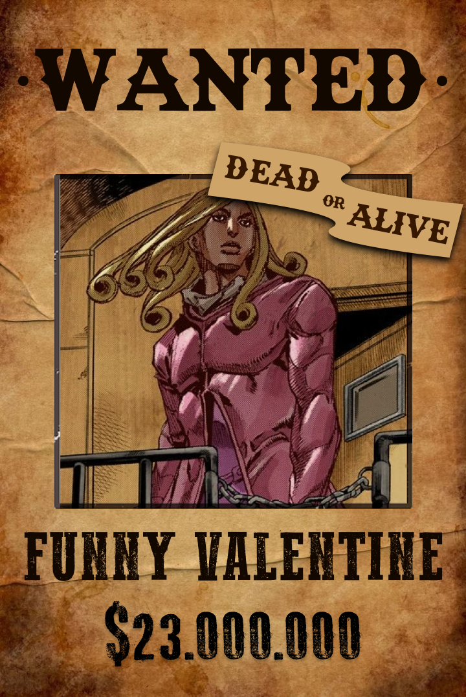

<div align="center">

# 🐎 Steel Ball Run — Wanted

**An animated bulletin board of wanted posters from _JoJo's Bizarre Adventure: Steel Ball Run_.**

Posters nailed to a board in the middle of the American desert, rippling in a gusty wind.
Click one and it unfolds into an 1890 newspaper edition about the rider it names.

<br />






<br />
<br />


</div>

---

## ✨ Features

- **A living desert.** A hand-built SVG scene with a setting sun, mesas, dunes, cacti and procedurally generated ridgelines. Clouds drift with the wind, a tumbleweed bounces across the sand now and then, and the layers shift in parallax as the pointer moves.
- **One wind for everything.** A single deterministic wind field (seeded 1D gradient noise with gusts and turbulence) drives the posters, the clouds and a canvas of blowing dust. Gusts cross the screen from left to right, so posters on one side catch them before the other.
- **Paper that behaves like paper.** Each poster is split into 8 chained 3D strips that curl, ripple and flap harder as the wind picks up, with light shading that follows the bend and a shadow that sways with them.
- **Micro-interactions.** On hover a poster lifts off the board, tilts toward the cursor, catches a moving glare and goes calm in the wind. Keyboard focus gets the same treatment.
- **Poster to newspaper transition.** Clicking a poster opens a native `<dialog>`. The panel grows out of the poster's exact on-screen box (rotation included) while keeping the poster's aspect ratio, then fades into the newspaper. Closing folds it back onto the board. Ambient animation pauses while the newspaper is open.
- **The Steel Ball Run Gazette.** Every character has a statically generated newspaper page with a blackletter masthead, portrait, fact box (age, race number, horse, Stand or technique), a short summary and their motive for joining the race.
- **Responsive board.** 6 × 2 on wide screens, 4 × 3 on tablets and portrait screens, 2 × 6 on phones.
- **Accessible by default.** Every poster is a real button with a descriptive label, the dialog traps focus and closes with <kbd>Esc</kbd> (even from inside the iframe), and `prefers-reduced-motion` swaps all motion for simple fades.

## 🤠 The cast

| Character | Horse | Ability |
| --- | --- | --- |
| Johnny Joestar | Slow Dancer | Stand: Tusk |
| Gyro Zeppeli | Valkyrie | Technique: The Spin |
| Lucy Steel | — | Stand: Ticket to Ride |
| Diego Brando | Silver Bullet | Stand: Scary Monsters |
| Hot Pants | Gets Up | Stand: Cream Starter |
| Mountain Tim | Ghost Rider in the Sky | Stand: Oh! Lonesome Me |
| Funny Valentine | — | Stand: Dirty Deeds Done Dirt Cheap |
| Sandman | None, he runs on foot | Stand: In a Silent Way |
| Pocoloco | Hey! Ya! | Stand: Hey Ya! |
| Ringo Roadagain | — | Stand: Mandom |
| Blackmore | — | Stand: Catch the Rainbow |
| Wekapipo | — | Technique: Wrecking Ball |

## 🚀 Getting started

You need **Node.js 20.9+**.

```bash
git clone https://github.com/Jlvieira0909/jojo-sbr.git
cd jojo-sbr
npm install
npm run dev
```

Then open [http://localhost:3000](http://localhost:3000).

| Script | What it does |
| --- | --- |
| `npm run dev` | Starts the development server |
| `npm run build` | Builds for production (the newspaper pages are pre-rendered) |
| `npm run start` | Serves the production build |
| `npm run lint` | Runs ESLint |

## 🗂️ Project structure

```text
app/
├── page.tsx                  # The scene: desert, board, dust and atmosphere
├── layout.tsx                # Fonts (Rye, IM Fell English) and metadata
└── newspaper/
    ├── fonts.ts              # Newspaper-only fonts, kept off the board
    └── [slug]/page.tsx       # The Steel Ball Run Gazette, one page per character
components/
├── board/
│   ├── BulletinBoard.tsx     # Board, grid and wind warm-up
│   ├── WantedPoster.tsx      # Paper strips, wind response and hover tilt
│   └── NewspaperDialog.tsx   # Poster-to-newspaper dialog transition
└── desert/
    ├── DesertBackdrop.tsx    # SVG scenery
    ├── DesertAmbience.tsx    # Clouds, tumbleweed and pointer parallax
    └── WindDust.tsx          # Canvas of blowing dust
lib/
├── characters.ts             # All character data
├── wind.ts                   # Shared wind field, clock and pause state
├── terrain.ts                # Ridge, scatter and tumbleweed generators
├── random.ts                 # Seeded random numbers
└── poster-image.ts           # Responsive poster backgrounds via image-set()
public/
├── posters/<slug>.png        # Wanted posters (720 × 1077)
└── portraits/<slug>.webp     # Newspaper portraits
```

## 🌬️ How the wind works

[`lib/wind.ts`](lib/wind.ts) is the heart of the scene. `windAt(time, x)` returns a strength between 0 and 1 built from:

- a constant light **breeze**,
- slow, layered **gusts** shaped with a smoothstep so the air is either calm or clearly blowing,
- fast, low-amplitude **turbulence**,
- a horizontal delay (`x`) so a gust visibly travels across the screen.

Everything runs on one clock hooked into `gsap.ticker`, and it only ticks while something is subscribed. Opening a newspaper pauses that clock, so the board stops moving behind the dialog. The wind also fades in over a few seconds after the page loads.

## 🖼️ Adding or replacing a character

1. Add an entry to `characters` in [`lib/characters.ts`](lib/characters.ts) with a unique `slug`.
2. Export the poster from Figma at **720 × 1077** and save it as `public/posters/<slug>.png`.
3. Add a portrait as `public/portraits/<slug>.webp`.

Posters and portraits are **imported** instead of referenced by path, so each file gets a content-hashed URL. Re-exporting a poster under the same name shows up right away, with no stale image cache.

## 🙏 Credits

- _JoJo's Bizarre Adventure: Steel Ball Run_ and all of its characters and artwork belong to **Hirohiko Araki** and **Shueisha**.
- Character facts and portrait art come from the [JoJo Wiki](https://jojowiki.com).
- Fonts: [Rye](https://fonts.google.com/specimen/Rye), [IM Fell English](https://fonts.google.com/specimen/IM+Fell+English), [UnifrakturMaguntia](https://fonts.google.com/specimen/UnifrakturMaguntia) and [Old Standard TT](https://fonts.google.com/specimen/Old+Standard+TT) from Google Fonts.
- Animation powered by [GSAP](https://gsap.com).

> [!NOTE]
> This is an unofficial, non-commercial fan project made for fun and learning. It is not affiliated with or endorsed by the rights holders.

<div align="center">
<br />
<sub>Made with 🌀 and a steel ball by <a href="https://github.com/Jlvieira0909">@Jlvieira0909</a></sub>
</div>
